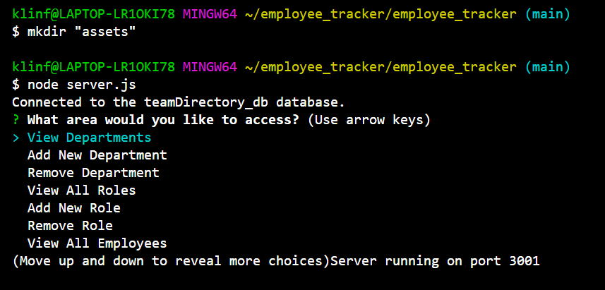
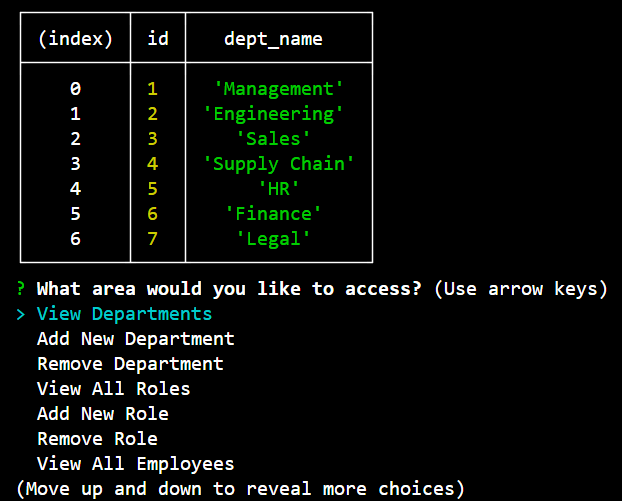
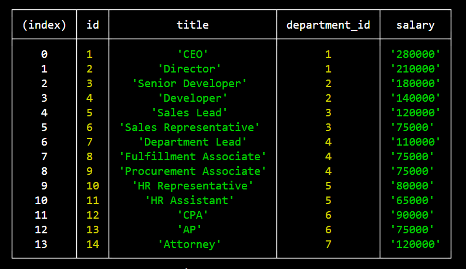

# employee_tracker
An application that stores information on employees and various departments in a database.

## Developer Info  
- Developed by Karl Linfeldt  
- [Github Repo](https://github.com/KarlOL82/employee_tracker)  
- [email](klinfeldt@gmail.com)  

## User Story  
AS A business owner
I WANT to be able to view and manage the departments, roles, and employees in my company
SO THAT I can organize and plan my business  

## Overview
This application runs in Node JS with Express, Inquirer, and MySQL. It creates a database with tables for Departments, Roles, and Employees which can be seeded with existing data and then updated as needed. Within each table, users can view, add, and remove rows via simple inquirer prompts. The Employees table has the added functionality to update the role of an existing employee.  

## Installation  
To install the application, clone the repo locally from the Github link above. After cloning, run "npm install" from the root directory. You will need to open MySQL within the "db" folder and source the schema.sql and seed.sql files.  

## Running the app  
To run this application, simply navigate to the root directory and run the server.js file from your terminal. Use the arrow keys on your keyboard to select actions in the terminal, the inquirer prompt will begin anew after each completed action.  

## License
    
  https://opensource.org/licenses/MIT  

  This application is using the MIT license.  

## Photos  

  

  

  

  

[Video Demo](https://www.youtube.com/watch?v=z3zrnxyoKpA)

